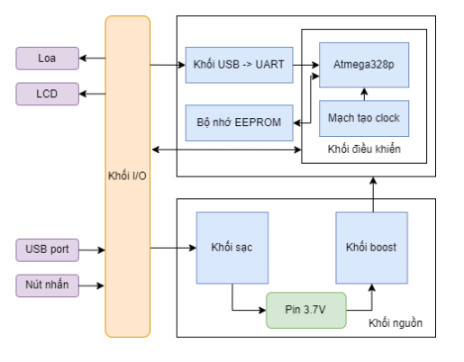
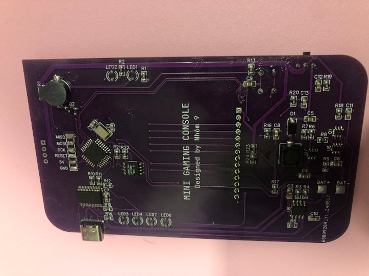

<a id="readme-top"></a>

<!-- PROJECT SHIELDS -->
<!--
*** I'm using markdown "reference style" links for readability.
*** Reference links are enclosed in brackets [ ] instead of parentheses ( ).
*** See the bottom of this document for the declaration of the reference variables
*** for contributors-url, forks-url, etc. This is an optional, concise syntax you may use.
*** https://www.markdownguide.org/basic-syntax/#reference-style-links
-->

[![Contributors][contributors-shield]][contributors-url]
[![Forks][forks-shield]][forks-url]
[![Stargazers][stars-shield]][stars-url]
[![Issues][issues-shield]][issues-url]
[![Unlicense License][license-shield]][license-url]
[![LinkedIn][linkedin-shield]][linkedin-url]

<!-- TABLE OF CONTENTS -->
<details>
  <summary>Mục lục</summary>
  <ol>
    <li>
      <a href="#giới-thiệu-về-dự-án">Giới thiệu về Dự án</a>
	  <ul>
        <li><a href="#các-tính-năng-chính">Các tính năng chính</a></li>
		<li><a href="#các-thành-phần-của-dự-án">Các thành phần của Dự án</a></li>
		<li><a href="#kiến-trúc-dự-án">Kiến trúc Dự án</a></li>
      </ul>
    </li>
    <li>
      <a href="#bắt-đầu">Bắt đầu</a>
      <ul>
        <li><a href="#yêu-cầu-cần-thiết">Yêu cầu cần thiết</a></li>
        <li><a href="#cài-đặt">Cài đặt</a></li>
      </ul>
    </li>
    <li><a href="#cách-chạy">Cách chạy</a></li>
    <li><a href="#thành-tựu">Thành tựu</a></li>
    <li><a href="#đóng-góp">Đóng góp</a></li>
    <li><a href="#liên-hệ">Liên hệ</a></li>
  </ol>
</details>

<!-- ABOUT THE PROJECT -->
## Giới thiệu về Dự án

Dự án này là một Mini Arduino Gaming Console được triển khai trên vi điều khiển Arduino. Dự án bao gồm ba trò chơi cổ điển: Flappy Bird, Ping Pong, và Hungry Snake, với kế hoạch tích hợp thêm trò Tetris (hiện tại bị comment trong mã nguồn). Mục tiêu của dự án là mang lại trải nghiệm chơi game đơn giản, thú vị, đồng thời thể hiện khả năng lập trình nhúng và thiết kế giao diện người dùng trên phần cứng hạn chế.

Dự án sử dụng Arduino để điều khiển màn hình, xử lý đầu vào từ các nút bấm, và quản lý logic trò chơi. Điểm số cao nhất của mỗi trò chơi được lưu trữ trong bộ nhớ EEPROM để đảm bảo dữ liệu bền vững. Ngoài ra, dự án có tiềm năng mở rộng với các tính năng như âm thanh (hiện bị vô hiệu hóa do nhiễu từ loa) và giao diện menu thân thiện.

Dự án làm chung với:
* [Vĩnh Khang](https://github.com/VinhKhangDam): Code toàn bộ tính năng, giao diện của game Hungry Snake.
* [Hoàn Khánh](https://github.com/NguyenHoanKhanh): Code toàn bộ tính năng, giao diện của game Ping Pong.


<p align="right">(<a href="#readme-top">Back to top</a>)</p>

### Các tính năng chính

* __Ba trò chơi cổ điển__: Flappy Bird, Ping Pong, Hungry Snake.
* __Giao diện đồ họa__: Sử dụng màn hình ILI9341 để hiển thị đồ họa 2D đơn giản, bao gồm các sprite, văn bản, và màu sắc tùy chỉnh.
* __Lưu trữ điểm cao__: Sử dụng EEPROM để lưu điểm số cao nhất cho từng trò chơi.
* __Điều khiển bằng nút bấm__: Năm nút bấm (Lên, Xuống, Trái, Phải, Giữa) để điều hướng menu và chơi game.
* __Menu chọn trò chơi__: Giao diện menu cho phép người dùng chọn giữa các trò chơi bằng nút Lên/Xuống và xác nhận bằng nút Giữa.
* __Hỗ trợ âm thanh (tùy chọn)__: Mã nguồn bao gồm định nghĩa giai điệu cho Snake và Ping Pong, nhưng hiện bị vô hiệu hóa do nhiễu loa.
* __Khả năng mở rộng__: Mã nguồn được tổ chức modular, dễ dàng thêm trò chơi mới hoặc cải tiến tính năng.

<p align="right">(<a href="#readme-top">Back to top</a>)</p>

### Các thành phần của Dự án

* __Source Phần mềm__
    * [main.ino](./Software/main/main.ino): File chính điều phối toàn bộ chương trình, bao gồm khởi tạo phần cứng, menu chọn trò chơi, và vòng lặp chính để chạy các trò chơi.
    * [Thư mục Flappy Bird](./Software/main/Flappy_bird/), [Thư mục Snake Game](./Software/main/Snake_game/), [Thư mục Ping Pong](./Software/main/Ping_pong/), (Pending) [Thư mục Tetris](./Software/main/Tetris/).
* __Source Phần cứng__
    * __Vi điều khiển Arduino__: Xử lý logic trò chơi và giao tiếp với các thiết bị ngoại vi.
    * __Màn hình ILI9341__: Hiển thị đồ họa 240x320 pixel, sử dụng thư viện [ILI9341_Fast](./Library/Fast_ILI9341_Library/).
    * __EEPROM AT24C256__: Lưu trữ điểm số cao nhất, sử dụng thư viện [AT24C](./Library/AT24C/).
    * __Nút bấm__: Năm nút bấm (pin 2, 3, 4, 5, 7) để điều khiển.
    * __Loa (tùy chọn)__: Pin 6 để phát âm thanh, nhưng hiện bị vô hiệu hóa.

<p align="right">(<a href="#readme-top">Back to top</a>)</p>

### Kiến trúc Dự án

#### Kiến trúc tổng quan



#### Schematic PCB


#### Layout PCB


#### Sơ đồ giải thuật game Flappy Bird


#### Sơ đồ giải thuật game Ping Pong


#### Sơ đồ giải thuật game Hungry Snake


<p align="right">(<a href="#readme-top">Back to top</a>)</p>

### Bắt đầu
Để thiết lập và chạy dự án Mini Arduino Gaming Console trên máy tính hoặc phần cứng thực tế, bạn cần cài đặt các công cụ cần thiết và làm theo các bước cài đặt dưới đây.

#### Yêu cầu cần thiết
Các công cụ sau cần thiết để biên dịch, nạp mã nguồn, và chạy dự án:

* __Arduino IDE__: Dùng để biên dịch và nạp mã nguồn lên vi điều khiển Arduino.
    ```text
    # Tải Arduino IDE từ trang chính thức:
    https://www.arduino.cc/en/software
    ```
* __Thư viện Arduino__: 
    * [ILI9341_Fast](./Library/Fast_ILI9341_Library/): Thư viện điều khiển màn hình ILI9341.
    * [AT24C256](./Library/AT24C/): Thư viện giao tiếp với EEPROM.
* __Phần cứng__: 
    * Arduino Uno hoặc tương thích.
    * Màn hình ILI9341 2.4 inch.
    * EEPROM AT24C256.
    * Năm nút bấm (kết nối với các chân 2, 3, 4, 5, 7).
    * Loa (tùy chọn, kết nối với chân 6, nhưng hiện không sử dụng).
* __Công cụ mô phỏng__ (tùy chọn): Proteus hoặc Tinkercad để mô phỏng mạch trước khi triển khai trên phần cứng thực tế.

#### Cài đặt
1. Sao chép kho mã nguồn
    ```sh
    git clone https://github.com/so1taynguyen/Mini-Arduino-gaming-console.git
    cd Mini-Arduino-gaming-console
    ```
2. Mở dự án trong Arduino IDE
    * Mở file main.ino trong Arduino IDE.
    * Đảm bảo tất cả các file header (trong các thư mục Flappy_bird, Snake_game, Ping_pong) được đặt đúng vị trí trong cùng thư mục với main.ino.
3. Cài đặt thư viện trong [Library](./Library/).
4. Kết nối phần cứng theo [schematic](./images/Schematic.png).
5. Thay đổi URL remote Git
    ```sh
    git remote set-url origin https://github.com/your_username/your_repo.git
    git remote -v # Kiểm tra thay đổi
    ```

<p align="right">(<a href="#readme-top">Back to top</a>)</p>

### Cách chạy

1. Chuẩn bị mã nguồn.
2. Biên dịch và nạp mã nguồn
    * Trong Arduino IDE, chọn board Arduino Uno (hoặc tương thích): Tools > Board > Arduino Uno.
    * Chọn cổng COM tương ứng: Tools > Port.
    * Nhấn Upload để nạp mã nguồn lên Arduino.
3. Chạy trên phần cứng

<p align="right">(<a href="#readme-top">Back to top</a>)</p>

### Thành tựu

#### PCB render 3D

* Top layer


* Bottom layer


#### PCB thực tế

* Top layer



* Bottom layer


<p align="right">(<a href="#readme-top">Back to top</a>)</p>

### Đóng góp

Chúng tôi hoan nghênh mọi đóng góp để cải thiện dự án. Một số gợi ý bao gồm tối ưu hóa mã nguồn, thêm trò chơi mới (như hoàn thiện Tetris), hoặc kích hoạt lại tính năng âm thanh với loa chất lượng cao hơn.

1. Fork dự án
2. Tạo nhánh tính năng
    ```sh
    git checkout -b feature/TenTinhNang
    ```
3. Commit thay đổi
    ```sh
    git commit -m "Thêm TenTinhNang"
    ```
4. Đầy lên nhánh
    ```sh
    git push origin feature/TenTinhNang
    ```
5. Mở Pull Request

<p align="right">(<a href="#readme-top">Back to top</a>)</p>

### Liên hệ

[](https://www.instagram.com/_2imlinkk/) [](https://www.linkedin.com/in/linkk-isme/) [](mailto:nguyenvanlinh0702.1922@gmail.com) 

<p align="right">(<a href="#readme-top">Back to top</a>)</p>

<!-- MARKDOWN LINKS & IMAGES -->
<!-- https://www.markdownguide.org/basic-syntax/#reference-style-links -->
[contributors-shield]: https://img.shields.io/github/contributors/othneildrew/Best-README-Template.svg?style=for-the-badge
[contributors-url]: https://github.com/so1taynguyen/Mini-Arduino-gaming-console/graphs/contributors
[forks-shield]: https://img.shields.io/github/forks/so1taynguyen/Mini-Arduino-gaming-console.svg?style=for-the-badge
[forks-url]: https://github.com/so1taynguyen/Mini-Arduino-gaming-console/network/members
[stars-shield]: https://img.shields.io/github/stars/so1taynguyen/Mini-Arduino-gaming-console.svg?style=for-the-badge
[stars-url]: https://github.com/so1taynguyen/Mini-Arduino-gaming-console/stargazers
[issues-shield]: https://img.shields.io/github/issues/so1taynguyen/Mini-Arduino-gaming-console.svg?style=for-the-badge
[issues-url]: https://github.com/so1taynguyen/Mini-Arduino-gaming-console/issues
[license-shield]: https://img.shields.io/github/license/so1taynguyen/Mini-Arduino-gaming-console.svg?style=for-the-badge
[license-url]: https://github.com/so1taynguyen/Mini-Arduino-gaming-console/blob/main/LICENSE
[linkedin-shield]: https://img.shields.io/badge/-LinkedIn-black.svg?style=for-the-badge&logo=linkedin&colorB=555
[linkedin-url]: https://www.linkedin.com/in/linkk-isme/